# Outpost · Omarchy 4

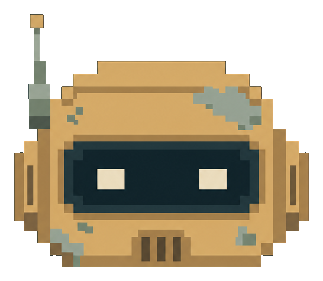

A pixel art theme for Omarchy inspired by remote outposts, wild landscapes, and life alongside robots.

[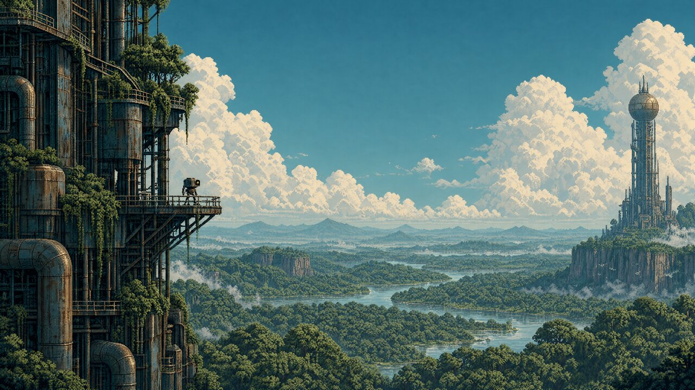](preview.png)

## Backgrounds

Twelve wallpapers, all 3840 × 2160. Click a preview to open the full-resolution PNG.

| | | |
| --- | --- | --- |
| [](backgrounds/01-forest.png)<br>Forest | [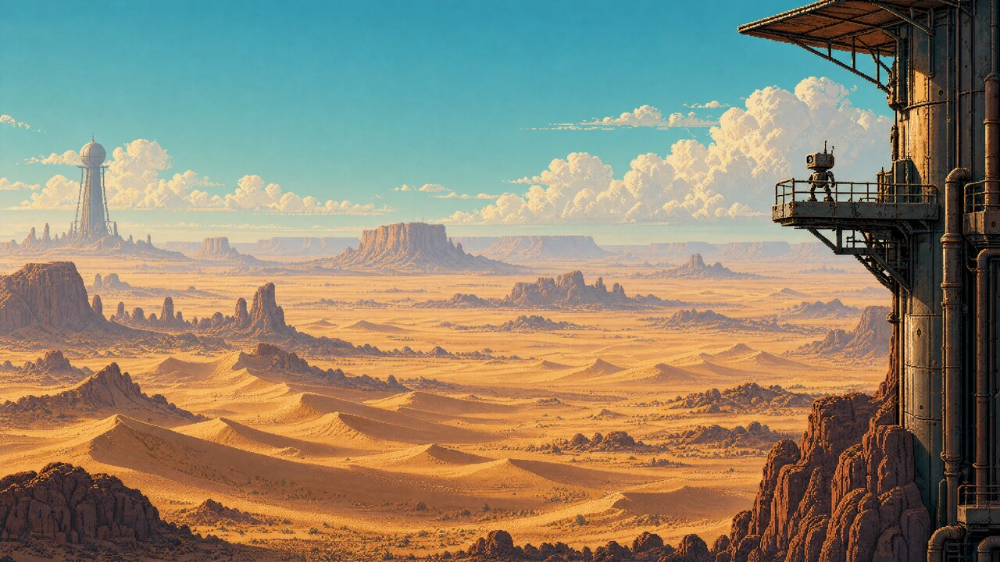](backgrounds/02-desert.png)<br>Desert | [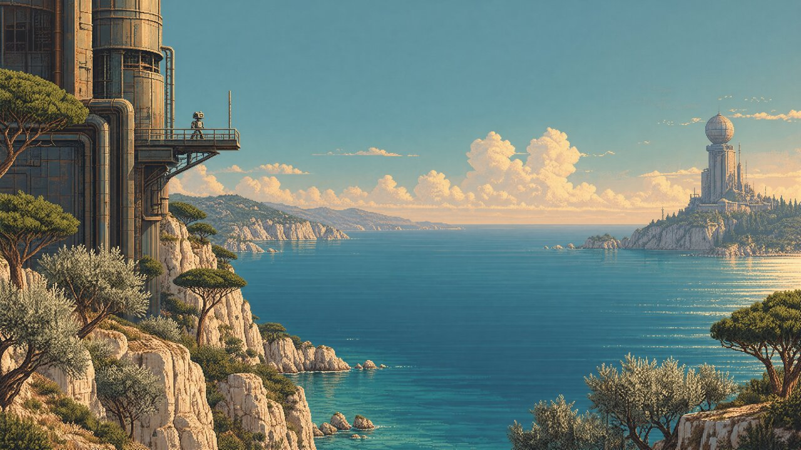](backgrounds/03-mediterranean.png)<br>Mediterranean |
| [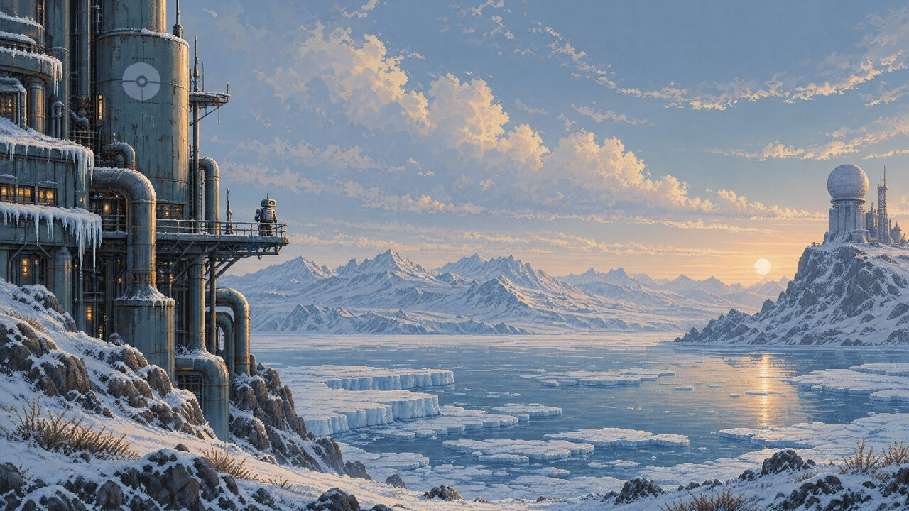](backgrounds/04-tundra.png)<br>Tundra | [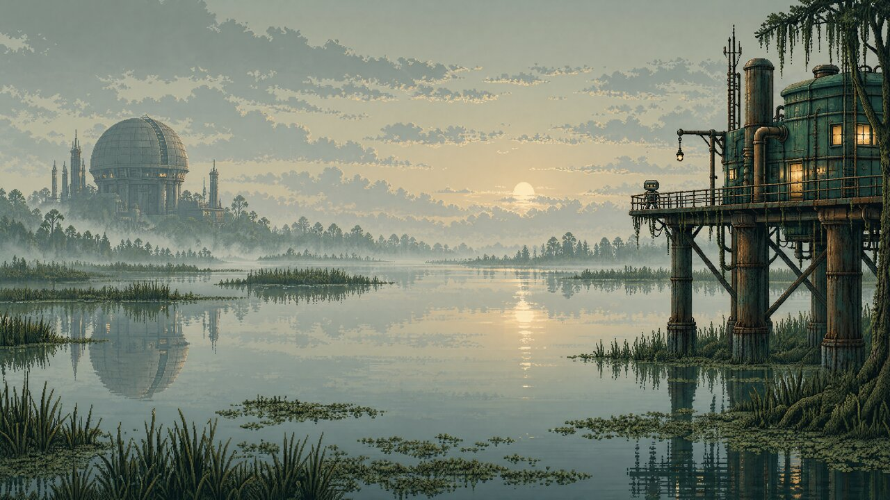](backgrounds/05-swamp.png)<br>Swamp | [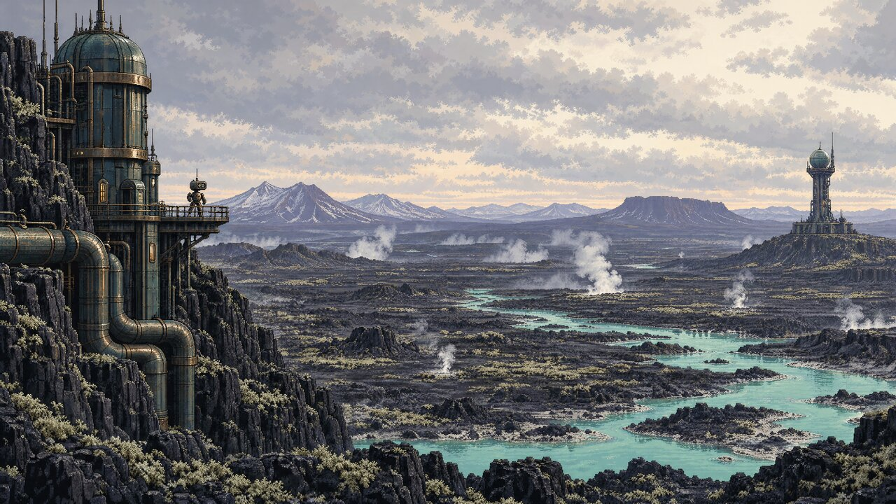](backgrounds/06-volcanic.png)<br>Volcanic |
| [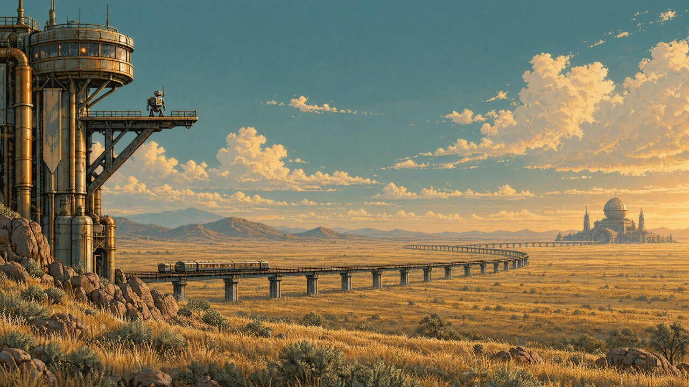](backgrounds/07-steppe.png)<br>Steppe | [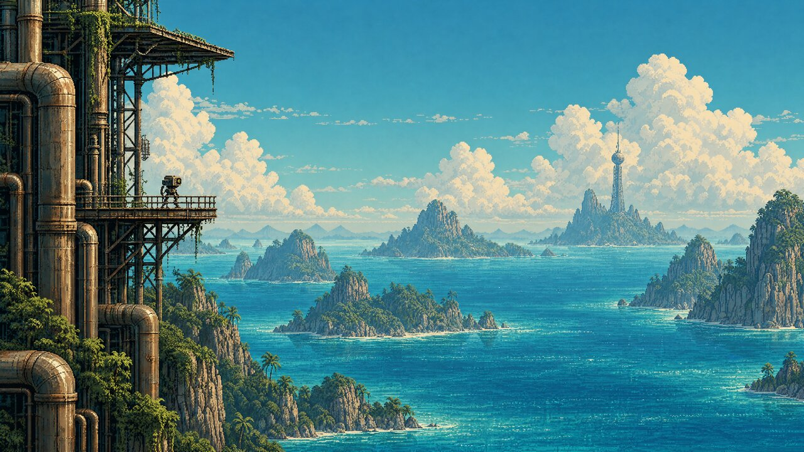](backgrounds/08-tropical-archipelago.png)<br>Tropical archipelago | [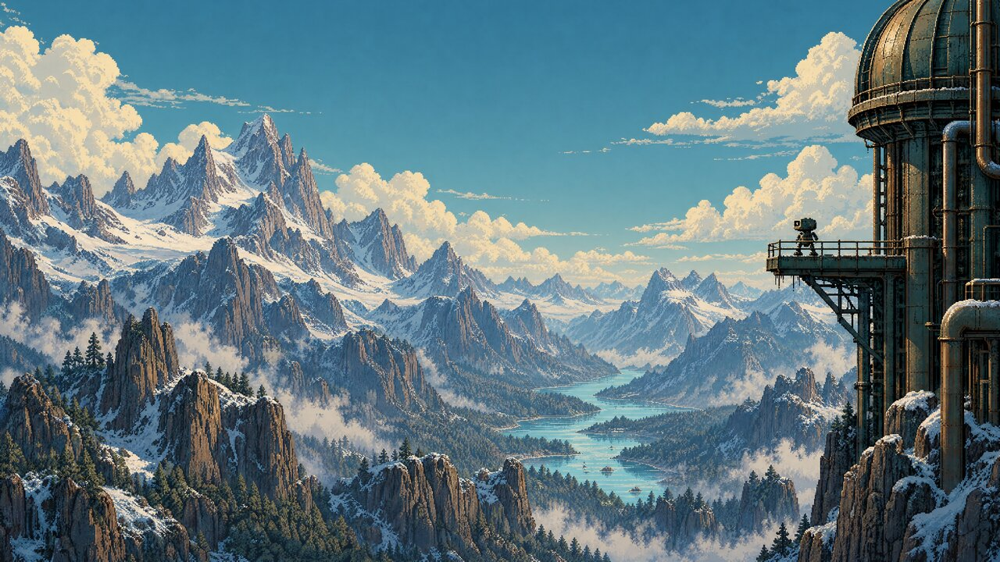](backgrounds/09-alpine.png)<br>Alpine mountains |
| [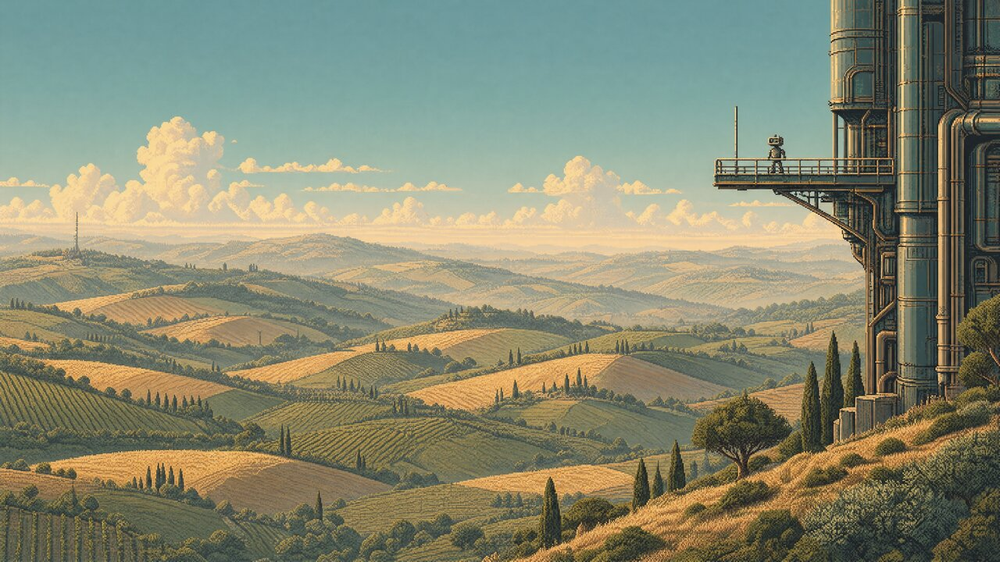](backgrounds/10-rolling-hills.png)<br>Rolling hills | [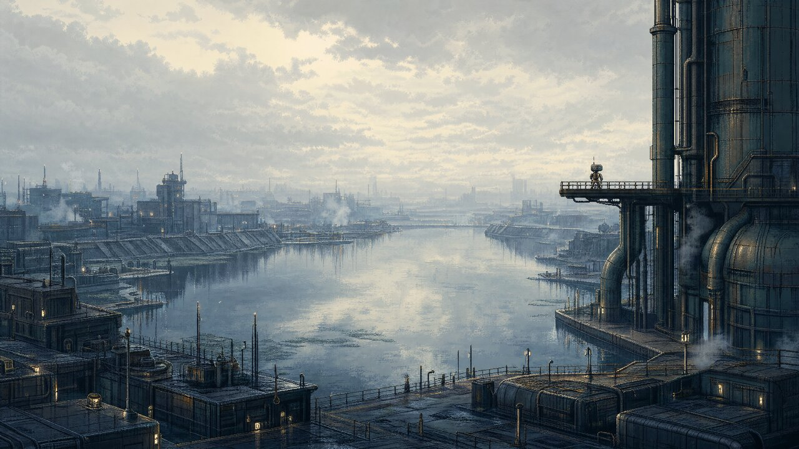](backgrounds/11-water-city.png)<br>Water city | [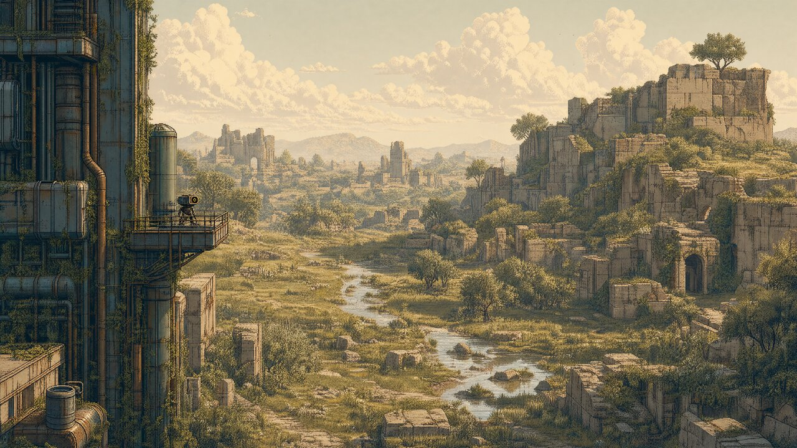](backgrounds/12-overgrown-ruins.png)<br>Overgrown ruins |

## Inspiration

Weathered retrofuturistic architecture frames vast open landscapes. Small maintenance robots provide scale, with petroleum shadows, bronze metal and ivory light shared across ten biomes and two urban landscapes. The palette interprets these common elements for the interface and stays fixed when the wallpaper changes.

## Installation

Once this repository has been published, run this command on your Omarchy 4 machine:

```sh
omarchy theme install https://github.com/simoz/omarchy-outpost-theme
```

To switch back, select your previous theme from Omarchy's theme menu.

## Unlock screen

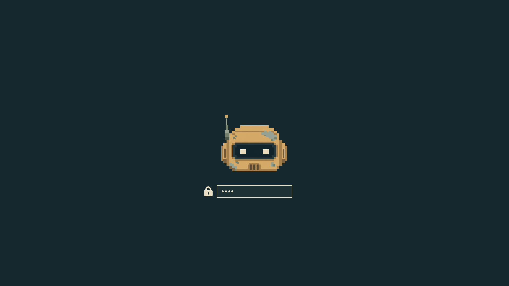

Select **Style → Unlock → Outpost** to use the robot at boot. `unlock.png` has a transparent background. This preview is composed using Omarchy’s Plymouth assets and layout; it is not a screenshot from a running system.

## Shell

Petroleum surfaces, ivory text and bronze borders carry through the bar, menus, launcher, notifications and authentication dialogs. Selected menu rows use a solid blue-green background. `shell.toml` defines the appearance; personal settings in `~/.config/omarchy/shell.toml` take precedence.

The session lock uses the current wallpaper with Omarchy’s built-in blur, an opaque petroleum password field and bronze borders. The robot belongs to the separate boot unlock screen.

## Desktop previews

The cover shows the wallpaper, not a desktop screenshot. Actual desktop, terminal, menu and lock-screen screenshots will be added after testing on Omarchy 4.

## Palette

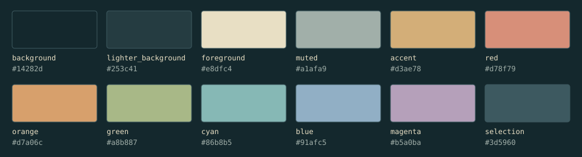

| Role | Color |
| --- | --- |
| Petroleum background | `#14282d` |
| Surfaces | `#253c41` |
| Ivory text | `#e8dfc4` |
| Bronze accent | `#d3ae78` |
| Selection | `#3d5960` |
| Secondary text | `#a1afa9` |
| Terracotta | `#d78f79` |
| Mist blue | `#91afc5` |

`colors.toml` contains the proposed palette, including bright terminal variants. `icons.theme` selects `Yaru-wartybrown`.

The volcanic scene is the most distant visually, with gray and lilac terrain, but petroleum metal, bronze highlights and turquoise water connect it to the palette. Tundra is cooler; desert and steppe are warmer. None currently appears to need recoloring or exclusion.

Opaque-color contrast: primary text 11.51:1 on the background; primary text 5.64:1 on selection; secondary text 5.12:1 on lighter surfaces. The eight semantic terminal colors exceed 4.5:1 on the main background. Transparency and application customizations may change these results.

## Compatibility

The theme uses the Omarchy 4 central palette format. Omarchy generates application configurations from its [official templates](https://github.com/omacom/omarchy/tree/quattro/default/themed), so separate configuration copies for each application are unnecessary. The included `shell.toml` customizes the shared shell surfaces. The palette is still proposed; appearance in a live Omarchy session has not been verified.

Run `python3 scripts/check_theme.py` with Python 3.11+ and Pillow to check contrast, image dimensions, checksums and documentation links. Optionally pass a directory of Omarchy templates to check substitution and JSON/TOML parsing.

## Image credits

Artwork created for Outpost with OpenAI image generation. Wallpapers are 3840 × 2160, with no post-generation upscaling; gallery previews are reduced copies. The unlock preview uses UI assets from [Omarchy](https://github.com/omacom/omarchy/tree/quattro/default/plymouth).

## License

See the [MIT License](LICENSE).
